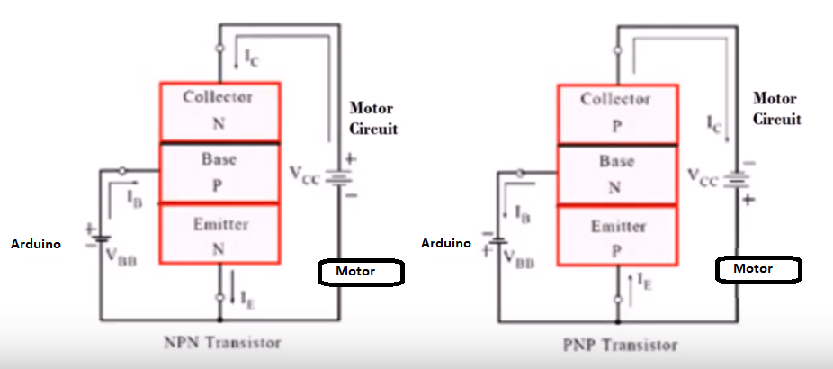

Video [a10-transistor](https://youtu.be/S6xwStw-t1U?list=PL57Dnr1H_egsL0r4RXPA4PY2yZhOJk5Nr&t=5s). Using a PNP transistor to protect the Photon while controlling a more powerful circuit, such as a 6V DC motor. A kind of cheap single direction DC motor driver using only a transistor. Probably good practice to put a small resistor in the arduino circuit.

