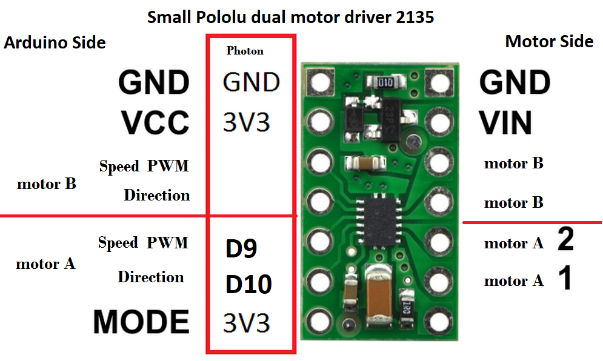
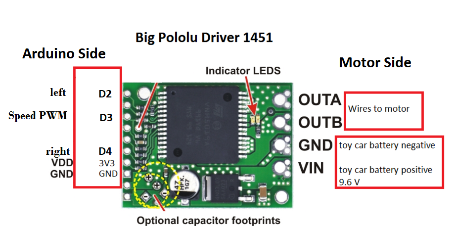

A11 DC Motor Drivers

Video [a11-DC-motor-drivers](https://youtu.be/-LZL-XpIsHs?list=PL57Dnr1H_egsL0r4RXPA4PY2yZhOJk5Nr&t=5s) For DC motors I would like you to use the web-app.ino and web-app.html to control both the [dual motor driver](https://www.pololu.com/product/713) which works for motors  up to to 13.5 V max and 1.2 Amp Max and the [big motor driver](https://www.pololu.com/product/1451) for DC motors up To 24V Max and 12 Amp Max .

Now it is your turn to make two working circuit diagrams from the images below and to get them running using the Photon and the Web-app. 

Use the two check.ino to test your electrical connections

Good luck.

[The Dual Motor Driver Pololu link](https://www.pololu.com/product/2135)

.

.
------------------------------------------------------------------------------------------------------------------------------

# Now for high voltages and currents

[The Big Motor Driver link](https://www.pololu.com/product/1451)

The dual motor driver (Max 11 V and 1.2 Amps for each motor) can control two motors (you only have to get one motor working :>), the big motor driver can only control one motor but it can run a larger current (30 Amps Max) and voltage (41 Volts Max). To prove that your motors work you can just use any 6V brushed DC motor. Sorry I don't have a good understanding yet of brushless motor drivers, but I will include a diagram when I can (The setup is easy it is the programming of the motor driver that seems confusing). 

The big motor driver has strange left and right digital pins. For many motors if both left and right are LOW (0) then the motor will coast. But if both left and right are HIGH (1) then the motor applies a brake! only if left is HIGH and right is low does it turn to the left (counterclockwise)

P.S. If the motor does not turn the way you want just switch the motor connected wires.
