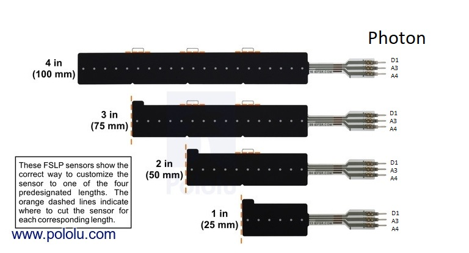

Force Sensor Linear Potentiometer

FSLP

Note: For the full 4 inch sensor to work all the tabs must be cut off. Until we know which length we want just work with the first inch of the sensor.

By Jeremy Ellis

Canadian High School Robotics Teacher

Maker of http://www.rocksetta.com

Twitter https://twitter.com/rocksetta

Use at your own risk!